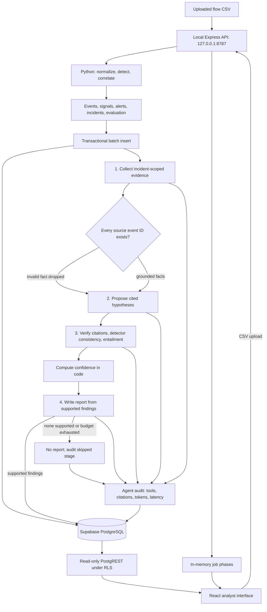

# AI-SOC architecture

The controller has fixed traversal. Python creates incidents before any LLM call;
LangGraph investigates only the evidence retrieved for a particular incident.

The browser holds only publishable credentials. Writes go through the local
backend's PostgreSQL connection. Uploads are serialized; each incident makes at
most four reasoning calls before retries, with process-wide spacing of 13 seconds.
Skipped nodes still produce audit records and consume no model tokens. The token
budget is checked between calls; an individual call may overshoot it, and verification
is retained for already proposed claims even when the budget has been reached.

Evidence retrieval follows `alerts.event_ids`. Legacy entity fallback is narrowed
by the incident's detector family; it refuses events when no matching family exists.
The collector rejects a whole fact if any source ID is absent. The verifier rejects
missing citations, absent evidence IDs, contradictory techniques, and absent or
negative entailment verdicts. Confidence is detector strength multiplied by
entailment strength; dataset-only annotation is capped at 50 percent.

The MLP is an offline evaluation artifact. It has no connection to the runtime graph.
Job phases are process-local and lost when the backend restarts; stored incident
records and agent audits survive in PostgreSQL.
