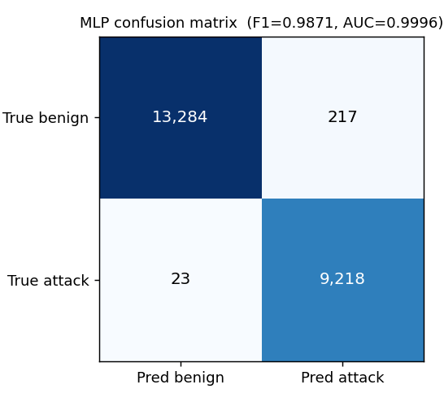
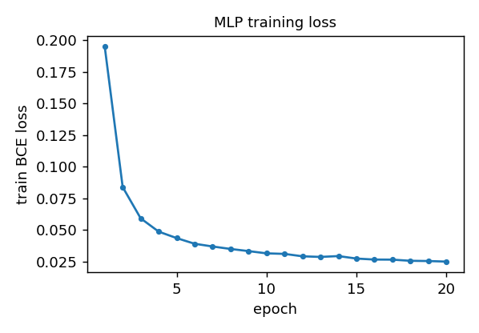

# AI-SOC project report

AI-SOC demonstrates evidence-grounded investigation of network-flow incidents.
An uploaded CSV is normalized, scored by deterministic detectors, and grouped into
incidents. Four LangGraph specialists collect evidence, propose ATT&CK hypotheses,
verify them, and write a report only from supported findings. The analyst can inspect
the source evidence and the rejected claims rather than relying on a narrative alone.

## Implementation and contribution

Python uses the standard library and streams the file twice. Header aliases map
CICIDS/CICFlowMeter fields to a canonical event representation. Rules detect
credential hammering, volumetric floods, and external beaconing; a packet-rate
z-score adds statistical evidence. Fixed family priority assigns each flow to a
single incident even when multiple detectors fire. Storage samples and the
twelve-incident cap bound database and investigation work. Truncation is reported.

The evidence collector retrieves incident-owned events through alert IDs. Its
grounding gate drops a whole fact containing any nonexistent source ID. The
verifier enforces evidence-ID resolution and detector-family consistency before
asking the model whether the cited facts entail the hypothesis. A missing verdict
means rejection. Confidence is calculated from detector and entailment strengths.
Dataset labels extend investigation coverage as explicitly marked annotations;
they never count as independent detection and their confidence is capped at 0.5.

Reports receive only supported hypotheses and their cited evidence. Responses are
simulation-only recommendations. Skipped stages are audited, including the report
stage when all claims fail. No response action is executed by this project.

See [architecture.md](architecture.md) for the diagram and data boundaries.

## Detection results

Historical measurements in `data/cicids_eval.json` score behavioural predictions
against dataset labels over all flows of the three selected captures:

| Scenario | TP | FP | FN | TN | Precision | Recall | F1 |
| --- | ---: | ---: | ---: | ---: | ---: | ---: | ---: |
| Brute force | 13,834 | 3,403 | 1 | 428,671 | 0.8026 | 0.9999 | 0.8904 |
| DDoS | 128,024 | 645 | 3 | 97,073 | 0.9950 | 1.0000 | 0.9975 |
| Botnet | 1,257 | 1,483 | 709 | 187,584 | 0.4588 | 0.6394 | 0.5342 |
| Overall | 143,115 | 5,531 | 713 | 713,328 | 0.9628 | 0.9950 | 0.9787 |

The overall figure is dominated by the flood corpus. Beaconing's false positives
and missed attacks remain visible. An annotation-only SQL-injection flow correctly
scores zero behavioural true positives in the regression suite.

## Deep learning artifact

`ml/train_mlp.py` implements a numpy MLP with 69 inputs, hidden layers of 64 and 32
ReLU units, and a sigmoid binary output. It uses Adam and binary cross-entropy for
20 epochs at learning rate 0.001, seed 1337. The stratified 70/30 split contains
53,059 training and 22,742 test flows. Stored test results are precision 0.9770,
recall 0.9975, F1 0.9871, accuracy 0.9894, and ROC-AUC 0.9996; the confusion matrix
is TN 13,284, FP 217, FN 23, TP 9,218. Final training loss is 0.0249.

These are existing offline results from `data/ml_eval.json`, not a newly trained
model or runtime classifier. A random flow split does not establish generalization
to new networks or capture days; a future study should use capture-disjoint splits.

## Investigation evaluation

`data/investigation_eval.json` records four historical investigations over three
incidents, 16 collected facts, 100% citation-grounding coverage, and one rejected
claim. Both comparison arms use the same hypotheses and verifier decisions:

| Measure | Verifier off | Verifier on |
| --- | ---: | ---: |
| Asserted claims | 4 | 3 |
| Verifier-rejected claims asserted | 1 | 0 |
| Rejected-claim rate among assertions | 25% | 0% |

Average recorded cost is 20,469 tokens and 42.7 seconds per investigation. The
rejected hypothesis described repeated SSH attempts that its cited evidence did
not establish. Subsequent incident-scoped retrieval produced a T1498 flood finding.

This comparison measures filtering according to the verifier's own verdicts. It
does not independently prove that all surviving claims are correct. The sample is
small and predates the current refactor. Preserve its historical provenance and
regenerate `npm run eval` after new investigations before citing current results.

## Reproduction and demo

Follow the [README](../README.md) for credentials, all migrations, and the two dev
processes. `bash scripts/check.sh` runs offline detection and safety regressions,
backend/frontend type checks, and the production build without model calls.

Use the DDoS slice first: it currently yields one incident. Brute-force and botnet
slices yield two and eight respectively after annotation bridging. Open the incident
record to show cited evidence, confidence basis, verifier verdicts, and the audit.
The [demo script](demo-scenarios.md) describes the walkthrough and historical example.

Fresh database initialization loads telemetry, not the historical agent runs.
Live reports and evaluation regeneration require a configured PostgreSQL connection
and Gemini key. Quota or overload failures are displayed per incident and do not
abort investigation of the remaining batch.

## Limitations and future work

The backend is localhost-only and unauthenticated; the frontend reads under RLS.
Ingestion is file-based, with three behavioural attack families. Other supported
classes depend on supplied annotations. Beaconing F1 is 0.53 on the stored full
capture evaluation. The MLP is offline. Model entailment can make mistakes,
and prompting against telemetry injection is a mitigation rather than a proof.
Job progress is in memory; a process restart loses it. Calls are serialized and
subject to provider quota. The final report writer is instructed to remain grounded,
but its prose does not receive a separate entailment pass.

Future work should prioritize an independent human-labelled claim evaluation,
capture-disjoint detection validation, persisted job recovery, and stronger beacon
features. Public deployment would require authentication and a reviewed write API.
These extensions are outside the handbook's frozen prototype architecture.
